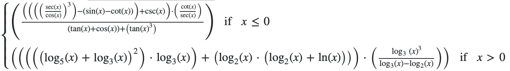

# ЛР2_343279

## Задание
Провести интеграционное тестирование программы, осуществляющей вычисление системы функций

$x <= 0 : ((((((sec(x) / cos(x)) ^ 3) - (sin(x) - cot(x))) + csc(x)) * (cot(x) / sec(x))) / ((tan(x) + cos(x)) + (tan(x) ^ 3)))$
$x > 0 : (((((log_5(x) + log_3(x)) ^ 2) * log_3(x)) + (log_2(x) * (log_2(x) + ln(x)))) * ((log_3(x) ^ 3) / (log_3(x) - log_2(x))))$

